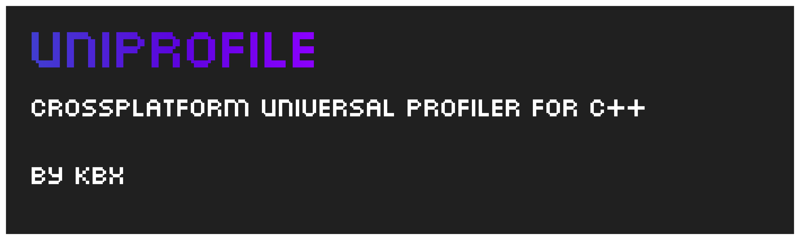

# uniprofile

A C++17 Header-Only, crossplatform and easy to implement profiler for applications.

[Download here.](https://github.com/PipeWarp/uniprofile/blob/master/include/uniprofile.h)

# Usage
As detailed in the header itself, make sure to define `#define UNIPROFILER_IMPLEMENTATION` before including it to create the implementation. (also define `#define UNIPROFILER_DEBUGTEXT` for debug text).

As for code, you will need to set a callback to a function that will return the time in seconds with `.setTimerFetchCallBack()` (such as `glfwGetTime()`). Then at any point in the program, you can start profiling a function/process with `.startProfile()` and `.endProfile()`. You can the name of the profile as an argument (make sure they are the same in both functions!).

To dump all the profiling info into a file, run `.dumpAllProfiles()`, with the file location being the argument.

[You can view the example project to get a better understanding on how to implement this library](https://github.com/PipeWarp/uniprofile/blob/master/example/)

# Why C++17
im lazy and i dont want to implement my own sorting algorithm, so im using std::sort.

